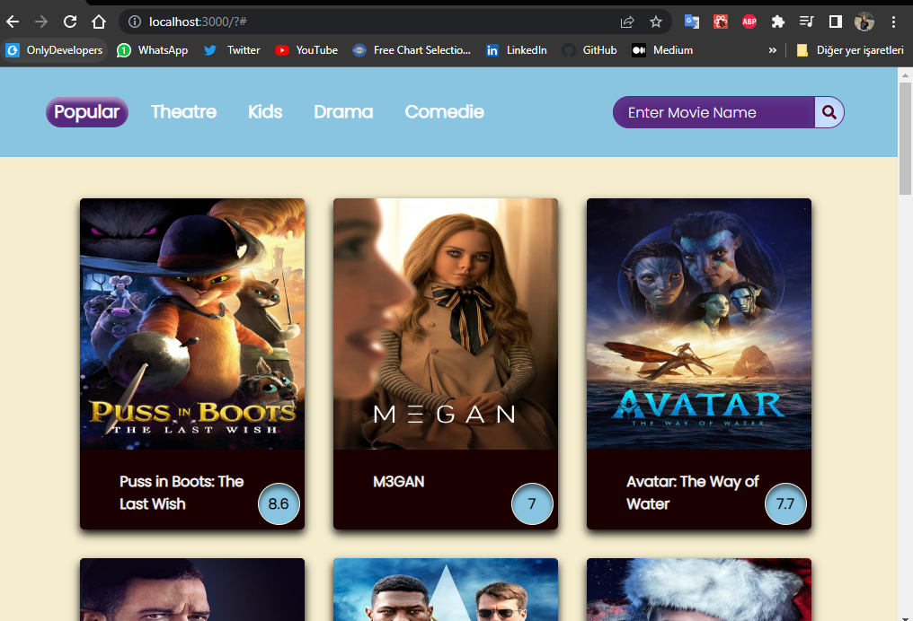
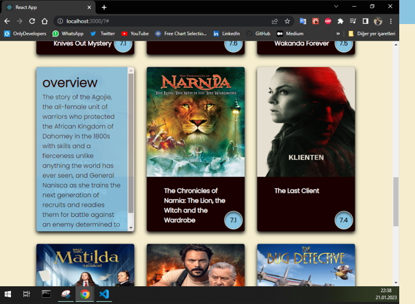
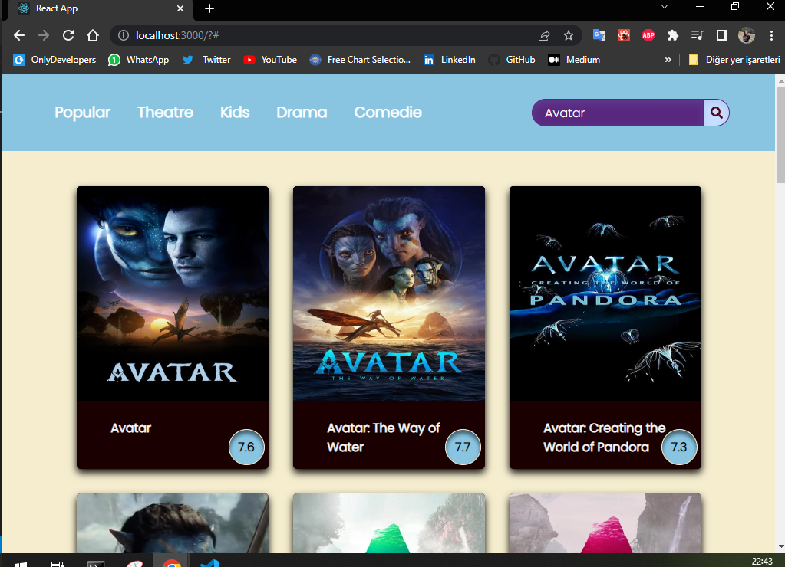
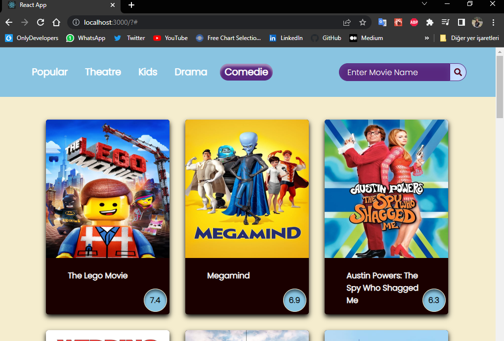

# The Steps of Movie Site Project with React

1-) Main view with css+ added navbar,search button
2-) Card component creation and card design
3-) Project has property media query
4-) Get API from (https://www.themoviedb.org/)
5-) Project includes hooks(useState, useEffect)
6-) Images Api
7-) Search Api

## Project Images

